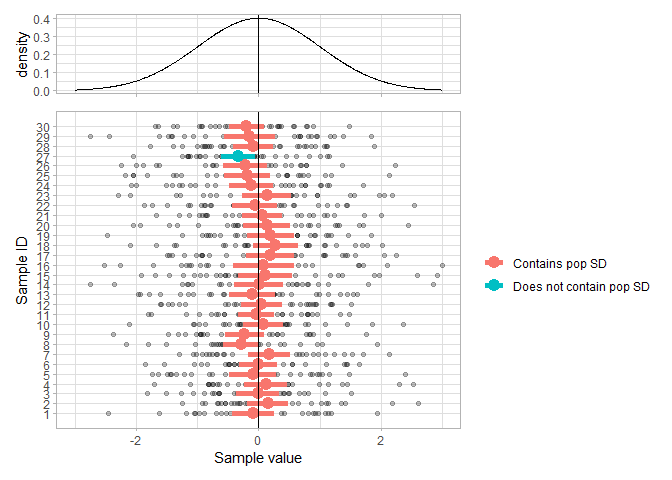

``` r
library(tidyverse)
library(patchwork)

n_samples <- 50
n <- 30

pop_mean <- 0
pop_sd <- 1

x_min <- -3
x_max <- 3
```

``` r
d <- tibble(sample = 1:n_samples,
            n = n) %>%
    mutate(data = map(n, rnorm, mean = pop_mean, sd = pop_sd),
           mean = map_dbl(data, mean),
           error = map2_dbl(data, n, ~ qnorm(0.975) * (sd(.x) / sqrt(.y))),
           ci_ll = mean - error,
           ci_ul = mean + error,
           contains_mu = ci_ll < pop_mean & ci_ul > pop_mean) %>%
    unnest(data)

samples <- d %>%
    mutate(contains_mu = ifelse(contains_mu, "Contains pop SD", "Does not contain pop SD")) %>%
    ggplot(aes(data, sample)) +
    geom_point(alpha = 0.25) +
    geom_point(aes(mean, sample, color = contains_mu), 
               size = 4) +
    geom_segment(aes(x = ci_ll, xend = ci_ul, y = sample, yend = sample, 
                     color = contains_mu),
                 linewidth = 2) +
    geom_vline(aes(xintercept = pop_mean)) +
    theme_light() +
    theme(panel.grid.minor.y = element_blank()) +
    scale_y_continuous(breaks = 1:n_samples) +
    xlim(x_min, x_max) +
    labs(x = "Sample value",
         y = "Sample ID",
         color = NULL)

pop_distribution <- tibble(x = seq(x_min, x_max, 0.01)) %>%
    mutate(density = dnorm(x)) %>%
    ggplot(aes(x, density)) +
    geom_line() +
    geom_vline(aes(xintercept = pop_mean)) +
    labs(x = NULL) +
    theme_light() +
    theme(axis.text.x = element_blank())

pop_distribution / samples + plot_layout(heights = c(2, 8))
```


